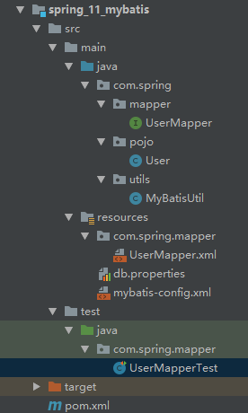

[TOC]


# Spring 学习

- Spring官网：[https://spring.io/](https://spring.io/)
- Spring framework官网：[https://spring.io/projects/spring-framework](https://spring.io/projects/spring-framework)
- Spring文档：[https://docs.spring.io/spring/docs/5.2.3.RELEASE/spring-framework-reference/core.html#spring-core](https://docs.spring.io/spring/docs/5.2.3.RELEASE/spring-framework-reference/core.html#spring-core)
- GitHub：[https://github.com/spring-projects/spring-framework](https://github.com/spring-projects/spring-framework)
- 下载地址：[https://repo.spring.io/release/org/springframework/spring/](https://repo.spring.io/release/org/springframework/spring/)
- 参考视频：[【狂神说Java】Spring5最新完整教程IDEA版通俗易懂_哔哩哔哩_bilibili](https://www.bilibili.com/video/BV1WE411d7Dv)
- 项目完整代码参考：[https://github.com/lexiaoyuan/SpringStudy](https://github.com/lexiaoyuan/SpringStudy)、[https://gitee.com/lexiaoyuan/spring-study](https://gitee.com/lexiaoyuan/spring-study)

> 优点：
>
> - Spring 是一个开源的免费的框架(容器)！
> - Spring是一个轻量级的、非侵入式的框架！
> - 控制反转（IOC），面向切面编程（AOP）！
> - 支持事务的处理和框架整合！
> - **Spring就是一个轻量级的控制反转（IOC）和面向切面编程（AOP）的框架！**

## 常用依赖

```xml
<!-- https://mvnrepository.com/artifact/org.springframework/spring-webmvc -->
<dependency>
    <groupId>org.springframework</groupId>
    <artifactId>spring-webmvc</artifactId>
    <version>5.2.2.RELEASE</version>
</dependency>

<dependency>
    <groupId>junit</groupId>
    <artifactId>junit</artifactId>
    <version>4.12</version>
</dependency>

<dependency>
    <groupId>org.aspectj</groupId>
    <artifactId>aspectjweaver</artifactId>
    <version>1.9.4</version>
</dependency>
```
## applicationContext.xml常用模板

### 基础模板

```xml
<?xml version="1.0" encoding="UTF-8"?>
<beans xmlns="http://www.springframework.org/schema/beans"
       xmlns:xsi="http://www.w3.org/2001/XMLSchema-instance"
       xsi:schemaLocation="http://www.springframework.org/schema/beans
        https://www.springframework.org/schema/beans/spring-beans.xsd">

</beans>
```
> 每写一个类就丢到beans.xml中。

### 添加注解支持的模板

```xml
<?xml version="1.0" encoding="UTF-8"?>
<beans xmlns="http://www.springframework.org/schema/beans"
       xmlns:xsi="http://www.w3.org/2001/XMLSchema-instance"
       xmlns:context="http://www.springframework.org/schema/context"
       xsi:schemaLocation="http://www.springframework.org/schema/beans
        https://www.springframework.org/schema/beans/spring-beans.xsd
        http://www.springframework.org/schema/context
        https://www.springframework.org/schema/context/spring-context.xsd">

	<!--配置注解支持-->
    <context:annotation-config/>
    
</beans>
```

### 添加AOP支持的模板

```xml
<?xml version="1.0" encoding="UTF-8"?>
<beans xmlns="http://www.springframework.org/schema/beans"
       xmlns:xsi="http://www.w3.org/2001/XMLSchema-instance"
       xmlns:aop="http://www.springframework.org/schema/aop"
       xsi:schemaLocation="http://www.springframework.org/schema/beans
        https://www.springframework.org/schema/beans/spring-beans.xsd
        http://www.springframework.org/schema/aop
        https://www.springframework.org/schema/aop/spring-aop.xsd">
	 <aop:config>
         <!-- 配置切入点或切面 -->
     </aop:config>
</beans>
```

## 使用容器

在测试类中：

```java
ApplicationContext context = new ClassPathXmlApplicationContext("beans.xml");
context.getBean();
```

## IOC推导

### 1. 环境搭建

- 创建普通的maven工程


- 删除src目录，在spring_study下新建module。


- 在根项目的pom.xml中添加全局的maven依赖

```xml
<dependencies>
    <!-- https://mvnrepository.com/artifact/org.springframework/spring-webmvc -->
    <dependency>
        <groupId>org.springframework</groupId>
        <artifactId>spring-webmvc</artifactId>
        <version>5.2.2.RELEASE</version>
    </dependency>

    <dependency>
        <groupId>junit</groupId>
        <artifactId>junit</artifactId>
        <version>4.12</version>
    </dependency>
</dependencies>
```

### 2. 传统方式

2.1 写dao接口及其实现类

```java
public interface UserDao {
    void getUser();
}
```

```java
public class UserDaoImpl implements UserDao {
    public void getUser() {
        System.out.println("默认获取用户数据");
    }
}
```

```java
public class UserDaoMysqlImpl implements UserDao {
    public void getUser() {
        System.out.println("MySql获取用户数据");
    }
}
```

```java
public class UserDaoOracleImpl implements UserDao {
    public void getUser() {
        System.out.println("Oracle获取用户数据");
    }
}
```

2.2 写service接口及其实现类

```java
public interface UserService {
    void getUser();
}
```

```java
public class UserServiceImpl implements UserService {

    private UserDao userDao;

    // 利用set实现值的动态注入
    public void setUserDao(UserDao userDao){
        this.userDao = userDao;
    }

    // 实际调用的是dao的方法
    public void getUser() {
        userDao.getUser();
    }
}
```

2.3 写测试类

```java
public class MyTest {
    public static void main(String[] args) {
   		//------传统方式-------
        //用户只关心业务层
        UserServiceImpl userService = new UserServiceImpl();
        // 想调用哪一种dao层的实现，就set哪一种
        userService.setUserDao(new UserDaoMysqlImpl());
        //用户调用service层的方法
        userService.getUser();
    }
}
```

运行结果：

`MySql获取用户数据`

### 3. 使用Spring

3.1 在resources目录下新建applicationContext.xml

```xml
<?xml version="1.0" encoding="UTF-8"?>
<beans xmlns="http://www.springframework.org/schema/beans"
       xmlns:xsi="http://www.w3.org/2001/XMLSchema-instance"
       xsi:schemaLocation="http://www.springframework.org/schema/beans
        https://www.springframework.org/schema/beans/spring-beans.xsd">
    <bean id="userDaoImpl" class="com.spring.dao.UserDaoImpl"/>
    <bean id="userDaoMysqlImpl" class="com.spring.dao.UserDaoMysqlImpl"/>
    <bean id="userDaoOracleImpl" class="com.spring.dao.UserDaoOracleImpl"/>
    <bean id="userServiceImpl" class="com.spring.service.UserServiceImpl">
        <property name="userDao" ref="userDaoMysqlImpl"/>
     </bean>
</beans>
```

3.2 测试

```java
public class MyTest {
    public static void main(String[] args) {
        //-------使用Spring--------
        ApplicationContext context = new ClassPathXmlApplicationContext("applicationContext.xml");
        UserServiceImpl userService = context.getBean("userServiceImpl", UserServiceImpl.class);
        userService.getUser();
    }
}
```

运行结果：

`MySql获取用户数据`

## HelloSpring

1. 写普通类

```java
public class Hello {
    private String name;

    public String getName() {
        return name;
    }

    public void setName(String name) {
        this.name = name;
    }

    @Override
    public String toString() {
        return "Hello{" +
                "name='" + name + '\'' +
                '}';
    }
}
```

2. 写applicationContext.xml

```xml
<?xml version="1.0" encoding="UTF-8"?>
<beans xmlns="http://www.springframework.org/schema/beans"
       xmlns:xsi="http://www.w3.org/2001/XMLSchema-instance"
       xsi:schemaLocation="http://www.springframework.org/schema/beans
        https://www.springframework.org/schema/beans/spring-beans.xsd">
    <!--
       Hello hello = new Hello();

       bean = 对象 Hello
       id = 变量名 hello
       class = new 的对象 Hello()，使用全限定名
       property = 给对象中的属性设置值 name="Hello Spring"
     -->

    <bean id="hello" class="com.spring.pojo.Hello">
        <property name="name" value="Hello Spring"/>
    </bean>
</beans>
```

3. 写测试类

```java
public class MyTest {
    public static void main(String[] args) {
        ApplicationContext context = new ClassPathXmlApplicationContext("applicationContext.xml");
        System.out.println(context.getBean("hello").toString());
    }
}
```

运行结果：`Hello{name='Hello Spring'}`

## IOC创建对象的方式

### 1. 使用无参构造创建对象，默认！

```java
public class User {
    private String name;

    public User() {
        System.out.println("使用User无参构造！");
    }

    public User(String name) {
        this.name = name;
        System.out.println("使用User有参构造！");
    }

    public String getName() {
        return name;
    }

    public void setName(String name) {
        this.name = name;
    }

    @Override
    public String toString() {
        return "User{" +
                "name='" + name + '\'' +
                '}';
    }
}
```

```xml
<!-- 默认-无参构造 -->
<bean id="user" class="com.spring.pojo.User">
    <property name="name" value="乐小猿-默认无参构造"/>
</bean>
```

```java
public static void main(String[] args) {
    ApplicationContext context = new ClassPathXmlApplicationContext("applicationContext.xml");
    User user = context.getBean("user", User.class);
    System.out.println(user.toString());
}
```

运行结果：

> 使用User无参构造！
> User{name='乐小猿-默认无参构造'}

### 2. 使用有参构造：

- 方式一：下标赋值

```xml
<!--第一种方式：下标赋值-->
<bean id="user" class="com.spring.pojo.User">
    <constructor-arg index="0" value="乐小猿-下标赋值" />
</bean>
```

运行结果：

> 使用User有参构造！
> User{name='乐小猿-下标赋值'}

- 方式二：通过类型创建，不建议使用

```xml
<!--第二种方式：通过类型创建，不建议使用-->
<bean id="user" class="com.spring.pojo.User">
    <constructor-arg type="java.lang.String" value="乐小猿-通过类型创建" />
</bean>
```

运行结果：

> 使用User有参构造！
> User{name='乐小猿-通过类型创建'}

- 方式三：通过参数名来设置【推荐】

```xml
<!-- 第三种方式：通过参数名来设置 -->
<bean id="user" class="com.spring.pojo.User">
    <constructor-arg name="name" value="乐小猿-通过参数名来设置"/>
</bean>
```

运行结果：

> 使用User有参构造！
> User{name='乐小猿-通过参数名来设置'}

## Spring配置

### 1. 别名

```xml
<!-- 别名，可以使用别名获取到这个对象-->
<alias name="user" alias="userNew"/>
```

```java
User user = context.getBean("userNew", User.class);  //可以通过别名获取到User对象
```

### 2. bean的配置

```xml
<!-- name属性也是别名，可以去多个，空格，逗号，分号都可以做分隔符-->
<bean id="user" class="com.spring.pojo.User" name="user2, user3 user4; user5">
    <constructor-arg name="name" value="乐小猿-通过参数名来设置"/>
</bean>
```

```java
//使用user,userNew,user2,user3,user4,user5都可以
User user = context.getBean("user5", User.class);  //可以通过别名获取到User对象
```

### 3. import

> 可以把多个配置文件导入合并为一个，使用的时候直接使用总配置就可以，多用于团队开发

```xml
<import resource="beans.xml"/>
<import resource="beans2.xml"/>
<import resource="beans3.xml"/>
```

## 依赖注入

### 1. 构造器注入

见 [IOC创建对象的方式](#IOC创建对象的方式)

### 2. set方式注入【重点】

- 依赖注入：set注入！
  - 依赖：bean对象的创建依赖于容器
  - 注入：bean对象的所有属性由容器来注入

【环境搭建】

```java
public class Address {
    private String address;

    public String getAddress() {
        return address;
    }

    public void setAddress(String address) {
        this.address = address;
    }

    @Override
    public String toString() {
        return "Address{" +
                "address='" + address + '\'' +
                '}';
    }
}
```

```java
public class Student {
    private String name;
    private Address address;
    private String[] books;
    private List<String> hobbies;
    private Map<String, String> card;
    private Set<String> games;
    private String wife;
    private Properties info;

    public String getName() {
        return name;
    }

    public void setName(String name) {
        this.name = name;
    }

    public Address getAddress() {
        return address;
    }

    public void setAddress(Address address) {
        this.address = address;
    }

    public String[] getBooks() {
        return books;
    }

    public void setBooks(String[] books) {
        this.books = books;
    }

    public List<String> getHobbies() {
        return hobbies;
    }

    public void setHobbies(List<String> hobbies) {
        this.hobbies = hobbies;
    }

    public Map<String, String> getCard() {
        return card;
    }

    public void setCard(Map<String, String> card) {
        this.card = card;
    }

    public Set<String> getGames() {
        return games;
    }

    public void setGames(Set<String> games) {
        this.games = games;
    }

    public String getWife() {
        return wife;
    }

    public void setWife(String wife) {
        this.wife = wife;
    }

    public Properties getInfo() {
        return info;
    }

    public void setInfo(Properties info) {
        this.info = info;
    }

    @Override
    public String toString() {
        return "Student{" +
                "name='" + name + '\'' +
                ", address=" + address.toString() +
                ", books=" + Arrays.toString(books) +
                ", hobbies=" + hobbies +
                ", card=" + card +
                ", games=" + games +
                ", wife='" + wife + '\'' +
                ", info=" + info +
                '}';
    }
}
```

```xml
<?xml version="1.0" encoding="UTF-8"?>
<beans xmlns="http://www.springframework.org/schema/beans"
       xmlns:xsi="http://www.w3.org/2001/XMLSchema-instance"
       xsi:schemaLocation="http://www.springframework.org/schema/beans
        https://www.springframework.org/schema/beans/spring-beans.xsd">

    <bean id="student" class="com.spring.pojo.Student">
        <!-- 第一种，普通类型注入，value-->
        <property name="name" value="徐仕成"/>

        <!-- 第二种，对象类型注入，ref-->
        <property name="address" ref="address"/>

        <!--  数组注入-->
        <property name="books">
            <array>
                <value>C语言权威指南</value>
                <value>计算机网络</value>
                <value>深入实践Spring Boot</value>
                <value>JavaScript 经典案例</value>
                <value>Vue.js实战</value>
            </array>
        </property>

        <!-- List注入-->
        <property name="hobbies">
            <list>
                <value>听歌</value>
                <value>敲代码</value>
                <value>看电影</value>
            </list>
        </property>

        <!-- Map注入 -->
        <property name="card">
            <map>
                <entry key="身份证" value="451564854684"/>
                <entry key="银行卡" value="42231316531321"/>
            </map>
        </property>

        <!-- Set注入-->
        <property name="games">
            <set>
                <value>LOL</value>
                <value>COC</value>
                <value>BOB</value>
            </set>
        </property>

        <!-- Properties注入-->
        <property name="info">
            <props>
                <prop key="driver">31620520</prop>
                <prop key="url">男</prop>
                <prop key="username">root</prop>
                <prop key="password">123456</prop>
            </props>
        </property>

        <!-- 空注入-->
        <property name="wife">
            <null/>
        </property>

    </bean>

    <bean id="address" class="com.spring.pojo.Address" >
        <property name="address" value="大新"/>
    </bean>

</beans>
```

```java
public class MyTest {
    public static void main(String[] args) {
        ApplicationContext context = new ClassPathXmlApplicationContext("applicationContext.xml");
        Student student = (Student) context.getBean("student");
        System.out.println(student.toString());
    }
}
```

运行结果：

```java
/*
* Student {
*   name='徐仕成',
*   address=Address{address='大新'},
*   books=[C语言权威指南, 计算机网络, 深入实践Spring Boot, JavaScript 经典案例, Vue.js实战],
*   hobbies=[听歌, 敲代码, 看电影],
*   card={
*       身份证=451564854684,
*       银行卡=42231316531321
*   },
*   games=[LOL, COC, BOB], wife='null',
*   info={
*       password=123456,
*       url=男,
*       driver=31620520,
*       username=root
*   }
* }
* */
```


### 3. 拓展方式注入

- 新建User类

```java
public class User {
    private String name;
    private String age;

    public User() {
    }

    public User(String name, String age) {
        this.name = name;
        this.age = age;
    }

    public String getName() {
        return name;
    }

    public void setName(String name) {
        this.name = name;
    }

    public String getAge() {
        return age;
    }

    public void setAge(String age) {
        this.age = age;
    }

    @Override
    public String toString() {
        return "User{" +
                "name='" + name + '\'' +
                ", age='" + age + '\'' +
                '}';
    }
}
```

- **引入p和c命名空间约束**

```xml
xmlns:p="http://www.springframework.org/schema/p"
xmlns:c="http://www.springframework.org/schema/c"
```

- p命名空间注入：相当于 `<property name="name" value="乐小猿"/>`、`<property name="age" value="21"/>`

```xml
<bean id="user" class="com.spring.pojo.User" p:name="乐小猿" p:age="21"/>
```

```java
User user = context.getBean("user", User.class);
System.out.println(user.toString());
```

【运行结果】

`User{name='乐小猿', age='21'}`

- c命名空间注入：**需要有参构造**，相当于`<constructor-arg name="name" value="乐小猿2"/>`，`<constructor-arg name="age" value="20"/>`

```xml
<bean id="user2" class="com.spring.pojo.User" c:name="乐小猿2" c:age="20" />
```

```java
User user2 = context.getBean("user2", User.class);
System.out.println(user2.toString());
```

【运行结果】

`User{name='乐小猿2', age='20'}`

## Bean自动装配

> Spring自动给bean装配属性！不用手动设置

- 在Spring中有三种装配方式：
  - 在xml中显示配置
  - 在Java中显示配置
  - 隐式的自动装配bean【重要】

1. 测试环境

```java
public class Cat {
    public void shout() {
        System.out.println("喵喵喵");
    }
}
```

```java
public class Dog {
    public void shout() {
        System.out.println("汪汪汪");
    }
}
```

```java
public class People {
    private Cat cat;
    private Dog dog;
    private String name;

    public Cat getCat() {
        return cat;
    }

    public void setCat(Cat cat) {
        this.cat = cat;
    }

    public Dog getDog() {
        return dog;
    }

    public void setDog(Dog dog) {
        this.dog = dog;
    }

    public String getName() {
        return name;
    }

    public void setName(String name) {
        this.name = name;
    }

    @Override
    public String toString() {
        return "People{" +
                "cat=" + cat +
                ", dog=" + dog +
                ", name='" + name + '\'' +
                '}';
    }
}
```

```xml
<bean id="cat" class="com.spring.pojo.Cat"/>
<bean id="dog" class="com.spring.pojo.Dog"/>

 <!-- 手动装配， 代码重复-->
<bean id="people" class="com.spring.pojo.People">
    <property name="cat" ref="cat"/>
    <property name="dog" ref="dog"/>
    <property name="name" value="乐小猿"/>
</bean>
```

2. 自动装配-byName

> byName：会自动在容器上下文找，和自己对象set方法中的对应的bean 的id，id要唯一

```xml
<!--自动装配autowire-->
<bean id="people" class="com.spring.pojo.People" autowire="byName">
    <property name="name" value="乐小猿"/>
</bean>
```

若修改如下：

```xml
<bean id="dog2" class="com.spring.pojo.Dog"/>
```

则运行结果如下：会出现空指针异常

> 喵喵喵
>
> java.lang.NullPointerException

3. 自动装配-byType

> 保持上面的修改，仍为`dog2`
>
> byType:会自动在容器上下文找，和自己对象属性类型相同的bean，不用起id，class要唯一.

```xml
<!--自动装配autowire-->
<bean id="people" class="com.spring.pojo.People" autowire="byType">
    <property name="name" value="乐小猿"/>
</bean>
```

运行结果正常：

> 喵喵喵
> 汪汪汪

可以省略id：

```xml
<bean class="com.spring.pojo.Cat"/>
<bean class="com.spring.pojo.Dog"/>
```

## 使用注解实现自动装配

首先在beans.xml中配置注解支持
```xml
<?xml version="1.0" encoding="UTF-8"?>
<beans xmlns="http://www.springframework.org/schema/beans"
       xmlns:xsi="http://www.w3.org/2001/XMLSchema-instance"
       xmlns:context="http://www.springframework.org/schema/context"
       xsi:schemaLocation="http://www.springframework.org/schema/beans
        https://www.springframework.org/schema/beans/spring-beans.xsd
        http://www.springframework.org/schema/context
        https://www.springframework.org/schema/context/spring-context.xsd">

	<!--配置注解支持-->
    <context:annotation-config/>
    
</beans>
```
- 第一种： @Autowired

然后在属性上添加，属性需要再IOC容器中存在，且符合命名
```java
//Autowired是按类型自动装配，如果有多个类型，则使用Qualifier(value = "cat222")，value中设置对应的id
@Autowired  
@Qualifier(value = "cat2")
```
使用Autowired后可以省略set方法

1. 测试环境

```java
public class Cat {
    public void shout() {
        System.out.println("喵喵喵");
    }
}
```

```java
public class Dog {
    public void shout() {
        System.out.println("汪汪汪");
    }
}
```

```java
public class People {

    @Autowired
    private Cat cat;
    @Autowired
    private Dog dog;
    private String name;

    public Cat getCat() {
        return cat;
    }
    //使用@Autowired，可以省略set方法
    public Dog getDog() {
        return dog;
    }
	//使用@Autowired，可以省略set方法
    public String getName() {
        return name;
    }

    public void setName(String name) {
        this.name = name;
    }

    @Override
    public String toString() {
        return "People{" +
                "cat=" + cat +
                ", dog=" + dog +
                ", name='" + name + '\'' +
                '}';
    }
}
```

```xml
<bean id="cat" class="com.spring.pojo.Cat"/>
<bean id="dog" class="com.spring.pojo.Dog"/>
<bean id="people" class="com.spring.pojo.People">
    <property name="name" value="乐小猿"/>
</bean>
```

测试：

```java
@Test
public void test(){
    ApplicationContext context = new ClassPathXmlApplicationContext("applicationContext.xml");
    People people = context.getBean("people", People.class);
    people.getCat().shout();
    people.getDog().shout();
}
```

若修改：

```xml
<bean id="cat1" class="com.spring.pojo.Cat"/>
<bean id="cat2" class="com.spring.pojo.Cat"/>
```

则会报错：

> Caused by: org.springframework.beans.factory.NoUniqueBeanDefinitionException: No qualifying bean of type 'com.spring.pojo.Cat' available: expected single matching bean but found 2: cat1,cat2

可以使用@Qualifier(value = "cat2")指定

```java
@Autowired
@Qualifier(value = "cat2")
private Cat cat;
```

- 第二种： @Resource、@Resource(name="cat1")

一样在属性上面添加，`@Resource`会先按byName的方式自动装配，再按byType的方式自动装配。

```java
//@Autowired
@Resource
private Dog dog;
```

```java
//@Autowired
//@Qualifier(value = "cat2")
@Resource(name = "cat1")
private Cat cat;
```

## 使用注解开发

**必须保证aop的包导入，同时需要context约束支持**

1. 测试环境

```xml
<?xml version="1.0" encoding="UTF-8"?>
<beans xmlns="http://www.springframework.org/schema/beans"
       xmlns:xsi="http://www.w3.org/2001/XMLSchema-instance"
       xmlns:context="http://www.springframework.org/schema/context"
       xsi:schemaLocation="http://www.springframework.org/schema/beans
        https://www.springframework.org/schema/beans/spring-beans.xsd
        http://www.springframework.org/schema/context
        https://www.springframework.org/schema/context/spring-context.xsd">

    <!--配置注解支持-->
    <context:annotation-config/>

    <!--开启包扫描，spring包下的注解都会生效-->
    <context:component-scan base-package="com.spring"/>

</beans>
```

```java
@Component
public class User {
    @Value("乐小猿")
    private String name;

    public String getName() {
        return name;
    }

    public void setName(String name) {
        this.name = name;
    }
}
```

```java
@Repository
public class UserDao {
}
```

```java
@Controller
public class UserController {
}
```

```java
@Service
public class UserService {
}
```

2. 测试

```java
public class MyTest {
    @Test
    public void test1(){
        ApplicationContext context = new ClassPathXmlApplicationContext("applicationContext.xml");
        User user = context.getBean("user", User.class);
        System.out.println(user.getName());
        user.setName("lexiaoyuan");
        System.out.println(user.getName());
    }
}
```

【运行结果】

> 乐小猿
> lexiaoyuan

### 常用注解

- @Autowired 自动装配属性，如果不能唯一装配属性，则使用@Qualifier(value = "aaa"),来唯一指定
- @Resource  自动装配属性，可以使用@Resource(name = "cat1")来指定属性
- @Nullable  字段允许为空
- @Component 组件，写在类上，等价于`  <bean id="user" class="com.spring.pojo.User"/>`,名字默认为类名的小写
- @Value("lexiaoyuan") 属性值，相当于`<property name="name" value="lexiaoyuan" />`
- @Repository 功能与@Component一样，通常在DAO层使用
- @Service 功能与@Component一样，通常在service层使用
- @Controller 功能与@Component一样，通常在controller层使用
- @Scope("prototype") 作用域（原型)

### 注解与XML

- xml万能，维护方便
- 注解，不是自己的类是使用不了，维护相对复杂

通常使用时：

- xml用来管理bean
- 属性通过注解来实现注入

注意，使用注解必须要开启注解支持`<context:annotation-config/>`

## 使用Java配置，不用xml

1. 新建配置类，代替xml

```java
//@Configuration代表这是一个配置类，等价于beans.xml
@Configuration
@ComponentScan("com.spring.pojo")
public class AppConfig {

    //注册一个Bean,就相当于beans.xml中的一个<bean/>标签，方法的名字就相当于id属性，
    // 返回值为对应类，相当于class属性
    @Bean
    public User user(){
        return new User();
    }
}
```

2. 普通类

```java
@Component
public class User {
    @Value("lexiaoyuan")  //属性注入值
    private String name;

    public String getName() {
        return name;
    }

    public void setName(String name) {
        this.name = name;
    }

    @Override
    public String toString() {
        return "User{" +
                "name='" + name + '\'' +
                '}';
    }
}
```

3. 测试类只能通过AnnotationConfigApplicationContext来获取容器，通过配置类.class来加载

```java
public class MyTest {
    @Test
    public void test1(){
        //只能通过AnnotationConfigApplicationContext来获取容器，通过配置类.class来加载
        ApplicationContext context = new AnnotationConfigApplicationContext(AppConfig.class);
        User user = context.getBean(User.class);
        System.out.println(user.getName());
    }
}
```

## 代理模式

### 静态代理

角色分析：

- 抽象角色：使用接口或抽象类来解决，需要代理的公共操作，如租房
- 真实角色：被代理的角色，如房东
- 代理角色：代理真实角色，同时有自己的附属操作，如中介
- 客户：访问代理对象的人，如租客

【**demo01：租房**】

代码步骤：

1. 接口，租房

```java
public interface Rent {
    void rent();
}
```

2. 真实角色，房东

```java
public class Host implements Rent {
    public void rent() {
        System.out.println("房东出租房子");
    }
}
```

3. 代理角色，中介

```java
public class Proxy implements Rent{
    private Host host;

    Proxy(Host hostname) {
        this.host = hostname;
    }

    public void rent() {
        seeHouse();
        host.rent();
        signContract();
        charge();
    }

    private void seeHouse(){
        System.out.println("中介带你看房子");
    }
    private void signContract(){
        System.out.println("中介带你签合同");
    }
    private void charge(){
        System.out.println("中介收取中介费");
    }
}
```

4. 客户，访问代理角色

```java
public class Client {
    public static void main(String[] args) {
        Host host = new Host();
        Proxy proxy = new Proxy(host);
        proxy.rent();
    }
}
```

【**demo02：用户常用业务，增加日志方法**】

1. 抽象对象：用户业务

```java
//抽象对象
public interface UserService {
    void add();
    void delete();
    void update();
    void query();
}
```

2. 真实对象：业务实现类

```java
//真实对象
public class UserServiceImpl implements UserService {
    public void add() {
        System.out.println("增加一个用户");
    }

    public void delete() {
        System.out.println("删除一个用户");
    }

    public void update() {
        System.out.println("修改一个用户");
    }

    public void query() {
        System.out.println("查询一个用户");
    }
}
```

3. 代理对象：代理类

```java
public class UserServiceProxyImpl implements UserService{
    private UserServiceImpl userService;

    void setUserService(UserServiceImpl userService) {
        this.userService = userService;
    }

    public void add() {
        log("add");
        userService.add();
    }

    public void delete() {
        log("delete");
        userService.delete();
    }

    public void update() {
        log("update");
        userService.update();
    }

    public void query() {
        log("query");
        userService.query();
    }

    //在代理对象中添加日志方法
    private void log(String msg){
        System.out.println("[Debug] 调用了"+msg+"方法");
    }
}
```

4. 客户

```java
public class Client {
    public static void main(String[] args) {
        UserServiceImpl userService = new UserServiceImpl();

        //使用代理对象来做一些操作
        UserServiceProxyImpl userServiceProxy = new UserServiceProxyImpl();
        userServiceProxy.setUserService(userService);

        userServiceProxy.update();
    }
}
```

### 动态代理

利用反射机制，`Interface InvocationHandler`、`Class Proxy`

- 动态代理和静态代理角色一样
- 动态代理的代理类是动态生成的，不是写好的（如`demo02:UserServiceProxyImpl`)
- 基于接口的代理
  - 基于接口——JDK动态代理
  - 。。。

一个动态代理类代理的是一个接口，一般就是对应一类业务。同时也可以代理多个类

【动态代理实现租房】

```java
public interface Rent {
    void rent();
}
```

```java
public class Host implements Rent {
    public void rent() {
        System.out.println("房东出租房子");
    }
}
```

```java
import java.lang.reflect.InvocationHandler;
import java.lang.reflect.Method;
import java.lang.reflect.Proxy;

//用这个类来自动生成代理类，这仅仅是一个处理程序
public class ProxyInvocationHandler implements InvocationHandler {

    //被代理的接口
    private Rent rent;

    void setRent(Rent rent) {
        this.rent = rent;
    }

    //生成代理类
    Object getProxy(){
        return Proxy.newProxyInstance(this.getClass().getClassLoader(),rent.getClass().getInterfaces(),this );
    }

    //处理代理实例，并返回结果
    public Object invoke(Object proxy, Method method, Object[] args) throws Throwable {
        //反射机制，通过method的invoke方法实现动态代理
        seeHouse();
        Object result = method.invoke(rent, args);
        charge();
        return result;
    }

    private void seeHouse(){
        System.out.println("中介带你看房子");
    }

    private void charge(){
        System.out.println("中介收中介费");
    }
}
```

```java
public class Client {
    public static void main(String[] args) {
        //真实角色
        Host host = new Host();

        //代理角色：现在没有
        //实例化代理处理实例
        ProxyInvocationHandler proxyInvocationHandler = new ProxyInvocationHandler();

        //通过代理处理的实例来设置代理对象
        proxyInvocationHandler.setRent(host);

        //生成代理类的对象，这个对象是动态生成的
        Rent proxy = (Rent) proxyInvocationHandler.getProxy();

        //通过代理对象租房
        proxy.rent();
    }
}
```

【动态代理实现用户业务代理】：

1. 编写生成代理类的处理程序

```java
//用这个类来自动生成代理类，这仅仅是一个处理程序
public class ProxyInvocationHandler implements InvocationHandler {

    //被代理的接口
    private Object target;

    public void setTarget(Object target) {
        this.target = target;
    }

    //生成代理类
    public Object getProxy(){
        return Proxy.newProxyInstance(this.getClass().getClassLoader(),target.getClass().getInterfaces(),this );
    }

    //处理代理实例，并返回结果
    public Object invoke(Object proxy, Method method, Object[] args) throws Throwable {
        //反射机制，通过method的invoke方法实现动态代理
        log(method.getName());
        Object result = method.invoke(target, args);
        return result;
    }

    //新增日志方法
    private void log(String msg) {
        System.out.println("[Debug] 调用了"+msg+"方法");
    }

}
```

2. 客户端：真实角色=>实例化生成代理类的程序=>设置要代理的对象=>动态生成代理类，得到代理角色=>通过代理角色调用真实角色的方法

```java
public class Client {
    public static void main(String[] args) {
        //真实角色
        UserServiceImpl userService = new UserServiceImpl();
        //代理角色，不存在
        ProxyInvocationHandler proxyInvocationHandler = new ProxyInvocationHandler();
        //设置要代理的对象
        proxyInvocationHandler.setTarget(userService);
        //动态生成代理类
        UserService userServiceProxy = (UserService) proxyInvocationHandler.getProxy();

        userServiceProxy.delete();
    }
}
```

## AOP（面向切面编程）

### 环境准备

首先导入对应依赖(pom.xml)

```xml
<dependencies>
    <dependency>
        <groupId>org.aspectj</groupId>
        <artifactId>aspectjweaver</artifactId>
        <version>1.9.4</version>
    </dependency>
</dependencies>
```

还要添加aop的约束支持（applicationContext.xml)

```xml
xmlns:aop="http://www.springframework.org/schema/aop"

http://www.springframework.org/schema/aop
https://www.springframework.org/schema/aop/spring-aop.xsd
```

### 基本环境：

```java
public interface UserService {
    void add();
    void delete();
    void update();
    void select();
}
```

```java
public class UserServiceImpl implements UserService {
    public void add() {
        System.out.println("增加了一个用户");
    }

    public void delete() {
        System.out.println("删除了一个用户");
    }

    public void update() {
        System.out.println("更新了一个用户");
    }

    public void select() {
        System.out.println("查询了一个用户");
    }
}
```

### 方式一：使用Spring API接口

- 主要是接口实现

1. 实现对应接口

如需要添加前置日志方法：实现`MethodBeforeAdvice`接口

```java
public class BeforeLog implements MethodBeforeAdvice {

    //method:要执行的目标对象方法
    //args:参数
    //target:目标对象
    public void before(Method method, Object[] args, Object target) throws Throwable {
        System.out.println(target.getClass().getName()+"的"+method.getName()+"方法被执行了");
    }
}
```

或添加后置日志方法：实现`AfterReturningAdvice`接口

```java
public class AfterLog implements AfterReturningAdvice {
    //returnValue:返回值
    public void afterReturning(Object returnValue, Method method, Object[] args, Object target) throws Throwable {
        System.out.println("执行了"+method.getName()+"方法，返回结果为："+returnValue);
    }
}
```

2. 配置AOP的xml约束：

```xml
<?xml version="1.0" encoding="UTF-8"?>
<beans xmlns="http://www.springframework.org/schema/beans"
       xmlns:xsi="http://www.w3.org/2001/XMLSchema-instance"
       xmlns:aop="http://www.springframework.org/schema/aop"
       xsi:schemaLocation="http://www.springframework.org/schema/beans
        https://www.springframework.org/schema/beans/spring-beans.xsd
        http://www.springframework.org/schema/aop
        https://www.springframework.org/schema/aop/spring-aop.xsd">
    <!--注册bean-->
    <bean id="userService" class="com.spring.service.UserServiceImpl"/>
    <bean id="beforeLog" class="com.spring.log.BeforeLog"/>
    <bean id="afterLog" class="com.spring.log.AfterLog"/>

    <!--第一种方式：使用Spring接口-->
    <!--配置AOP:需要导入aop的约束-->
    <aop:config>
        <!-- 切入点：expression:表达式(好定位到切入点的位置)，execution(要执行的位置)-->
        <aop:pointcut id="userServicePointCut" expression="execution(* com.spring.service.UserServiceImpl.*(..))"/>

        <!-- 执行环绕增加！-->
        <!-- 将beforeLog类切入到userServicePointCut的位置-->
        <aop:advisor advice-ref="beforeLog" pointcut-ref="userServicePointCut"/>
        <!-- 将afterLog类切入到pointCut1的位置-->
        <aop:advisor advice-ref="afterLog" pointcut-ref="userServicePointCut"/>
    </aop:config>
</beans>
```

3. 测试

```java
public class MyTest {
    public static void main(String[] args) {
        ApplicationContext context = new ClassPathXmlApplicationContext("applicationContext.xml");
        //动态代理，代理的是接口，不能写成具体的实现类
        UserService userService = context.getBean("userService", UserService.class);
        userService.add();
        userService.delete();
        userService.update();
        userService.select();
    }
}
```

【运行结果】

> com.spring.service.UserServiceImpl的add方法被执行了
> 增加了一个用户
> 执行了add方法，返回结果为：null
> com.spring.service.UserServiceImpl的delete方法被执行了
> 删除了一个用户
> 执行了delete方法，返回结果为：null
> com.spring.service.UserServiceImpl的update方法被执行了
> 更新了一个用户
> 执行了update方法，返回结果为：null
> com.spring.service.UserServiceImpl的select方法被执行了
> 查询了一个用户
> 执行了select方法，返回结果为：null

小结：

> 业务类只关注写业务，增加日志方法就只关注实现日志方法，通过Spring配置来实现切面的插入。

### 方式二：自定义类

- 主要是切面定义

1. 自定义类diy.DiyPointCut

```java
public class DiyPointCut {
    public void diyBefore(){
        System.out.println("=======方法执行前========");
    }
    public void diyAfter(){
        System.out.println("==========方法执行后=========");
    }
}
```

并注册到Spring容器

```xml
 <bean id="diyPointCut" class="com.spring.diy.DiyPointCut"/>
```

2. 重新配置aop,自定义切面

```xml
<!-- 第二种方式:自定义类-->
    <aop:config>
        <!-- 自定义切面-->
        <aop:aspect ref="diyPointCut">
            <!-- 定义切点：com.spring.service.UserServiceImpl.*(..) ，UserServiceImpl类下的所有方法-->
            <aop:pointcut id="pointCut" expression="execution(* com.spring.service.UserServiceImpl.*(..))"/>
            <!-- 切点pointCut执行前执行diyPointCut中的diyBefore方法-->
            <aop:before method="diyBefore" pointcut-ref="pointCut"/>
            <!-- 切点pointCut执行后执行diyPointCut中的diyAfter方法-->
            <aop:after method="diyAfter" pointcut-ref="pointCut"/>
        </aop:aspect>
    </aop:config>
```

【运行结果】


### 方式三：使用注解

1. 自定义类diy.AnnotationPointCut

注意：`@Aspect`、`@Before`、`@After`、`@Around`等注解是导自`import org.aspectj.lang.annotation.*;`

```java
@Aspect  //标注这个类为一个切面
public class AnnotationPointCut {
    //@Before：方法执行前，参数为表达式，定义切点位置
    @Before("execution(* com.spring.service.UserServiceImpl.*(..))")
    public void annoBefore(){
        System.out.println("方法执行前");
    }

    //@After：方法执行后，参数为表达式，定义切点位置
    @After("execution(* com.spring.service.UserServiceImpl.*(..))")
    public void annoAfter(){
        System.out.println("方法执行后");
    }


    // 在环绕增强中，给定一个参数ProceedingJoinPoint pjp，代表我们要执行的切入点
    @Around("execution(* com.spring.service.UserServiceImpl.*(..))")
    public void annoArround(ProceedingJoinPoint pjp) throws Throwable {
        System.out.println("环绕前");
        pjp.proceed(); //执行方法
        System.out.println("环绕后");
    }
}
```

2. 配置aop,开启aop的注解支持

```xml
<!-- 第三种方式：使用注解-->
<bean id="annotationPointCut" class="com.spring.diy.AnnotationPointCut"/>
<!--  不再需要<aop:config>配置，使用了注解-->
<!--  开启aop切面的注解支持  -->
<aop:aspectj-autoproxy/>
```

【运行结果】

> 环绕前
> 方法执行前
> 增加了一个用户
> 环绕后
> 方法执行后
> 环绕前
> 方法执行前
> 删除了一个用户
> 环绕后
> 方法执行后
> 环绕前
> 方法执行前
> 更新了一个用户
> 环绕后
> 方法执行后
> 环绕前
> 方法执行前
> 查询了一个用户
> 环绕后
> 方法执行后

## Spring整合MyBatis

### 初步整合-回顾mybatis

步骤：

1. 导入相关jar包

   - junit
   - mybatis
   - mysql数据库
   - spring相关
   - aop织入
   - mybatis-spring
   - lombok

   ```xml
   <dependencies>
       <dependency>
           <groupId>mysql</groupId>
           <artifactId>mysql-connector-java</artifactId>
           <version>5.1.47</version>
       </dependency>
   
       <dependency>
           <groupId>org.mybatis</groupId>
           <artifactId>mybatis</artifactId>
           <version>3.5.2</version>
       </dependency>
   
       <dependency>
           <groupId>org.springframework</groupId>
           <artifactId>spring-webmvc</artifactId>
           <version>5.2.2.RELEASE</version>
       </dependency>
   
       <dependency>
           <groupId>org.springframework</groupId>
           <artifactId>spring-jdbc</artifactId>
           <version>5.0.9.RELEASE</version>
       </dependency>
   
       <dependency>
           <groupId>org.aspectj</groupId>
           <artifactId>aspectjweaver</artifactId>
           <version>1.9.4</version>
       </dependency>
   
       <dependency>
           <groupId>org.mybatis</groupId>
           <artifactId>mybatis-spring</artifactId>
           <version>2.0.3</version>
       </dependency>
   
       <dependency>
           <groupId>org.projectlombok</groupId>
           <artifactId>lombok</artifactId>
           <version>1.18.12</version>
       </dependency>
       
       <dependency>
           <groupId>junit</groupId>
           <artifactId>junit</artifactId>
           <version>4.12</version>
       </dependency>
   </dependencies>
   ```

2. 编写代码

> 注意：开启数据库，保证数据库能连上

- 数据库连接的配置文件**`db.properties`**

```properties
driver=com.mysql.jdbc.Driver
url=jdbc:mysql://localhost:3306/mybatis?useUnicode=true&characterEncoding=UTF-8&serverTimezone=UTC&useSSL=true
username=root
password=123456
```

- mybatis核心配置文件**`mybatis-config.xml`**

```xml
<?xml version="1.0" encoding="UTF-8" ?>
<!DOCTYPE configuration
        PUBLIC "-//mybatis.org//DTD Config 3.0//EN"
        "http://mybatis.org/dtd/mybatis-3-config.dtd">
<configuration>
    
    <properties resource="db.properties"/>
    
    <settings>
        <setting name="logImpl" value="STDOUT_LOGGING"/>
    </settings>

    <typeAliases>
        <package name="com.spring.pojo"/>
    </typeAliases>
    
    <environments default="development">
        <environment id="development">
            <transactionManager type="JDBC"/>
            <dataSource type="POOLED">
                <property name="driver" value="${driver}"/>
                <property name="url" value="${url}"/>
                <property name="username" value="${username}"/>
                <property name="password" value="${password}"/>
            </dataSource>
        </environment>
    </environments>

    <mappers>
        <mapper resource="com/spring/mapper/UserMapper.xml"/>
    </mappers>

</configuration>
```

- 编写mybatis工具类**`MyBatisUtil`**

```java
public class MyBatisUtil {

    private static SqlSessionFactory sqlSessionFactory = null;

    static {
        try {
            String resource = "mybatis-config.xml";
            InputStream inputStream = Resources.getResourceAsStream(resource);
            sqlSessionFactory = new SqlSessionFactoryBuilder().build(inputStream);
        } catch (IOException e) {
            e.printStackTrace();
        }
    }

    public static SqlSession getSqlSession() {
        return sqlSessionFactory.openSession(true);
    }
}
```

- 写实体类**`User`**

```java
import lombok.Data;

@Data
public class User {
    private int id;
    private String name;
    private String pwd;
}
```

- 写实体类对应的接口**`UserMapper`**

```java
public interface UserMapper {
    List<User> selectUserAll();
}
```

- 写接口的映射文件**`UserMapper.xml`**

```xml
<?xml version="1.0" encoding="UTF-8" ?>
<!DOCTYPE mapper
        PUBLIC "-//mybatis.org//DTD Mapper 3.0//EN"
        "http://mybatis.org/dtd/mybatis-3-mapper.dtd">

<mapper namespace="com.spring.mapper.UserMapper">
    <select id="selectUserAll" resultType="user">
        select * from mybatis.user
    </select>
</mapper>
```

- 写测试类**`UserMapperTest`**

```java
public class UserMapperTest {
    @Test
    public void selectUserAllTest(){
        SqlSession sqlSession = MyBatisUtil.getSqlSession();
        UserMapper mapper = sqlSession.getMapper(UserMapper.class);

        List<User> users = mapper.selectUserAll();
        for (User user : users) {
            System.out.println(user);
        }

        sqlSession.close();
    }
}
```

【运行结果】


附目录结构：



### 更新整合

1. 使用Spring的方式重新配置数据源连接数据库

```xml
<!--配置数据源dataSource
    使用Spring提供的数据源替换MyBatis的配置，也可以使用第三方的数据源，如c3p0,dbcp,druid等
    我们这里使用Spring提供的JDBC数据源:org.springframework.jdbc.datasource
-->
<bean id="dataSource" class="org.springframework.jdbc.datasource.DriverManagerDataSource">
    <property name="driverClassName" value="com.mysql.jdbc.Driver"/>
    <property name="url" value="jdbc:mysql://localhost:3306/mybatis?useUnicode=true&amp;characterEncoding=UTF-8&amp;serverTimezone=UTC&amp;useSSL=true"/>
    <property name="username" value="root"/>
    <property name="password" value="123456" />
</bean>
```

2. 使用 `SqlSessionFactoryBean` 来创建`SqlSessionFactory`对象

```xml
<!--在MyBatis-Spring中，使用SqlSessionFactoryBean来创建sqlSessionFactory-->
<bean id="sqlSessionFactory" class="org.mybatis.spring.SqlSessionFactoryBean">
    <property name="dataSource" ref="dataSource" />
    <!--绑定MyBatis核心配置文件-->
    <property name="configLocation" value="classpath:mybatis-config.xml"/>
    <!--mapperLocations属性用来指定MyBatis的映射器XML配置文件的位置-->
    <property name="mapperLocations" value="classpath*:com/spring/mapper/*.xml"/>
</bean>
```

3. 使用`SqlSessionTemplate`来创建`SqlSession`对象

```xml
<!--SqlSessionTemplate：作为SqlSession的一个实现，可以使用它无缝代替你代码中已经在使用的SqlSession。-->
<bean id="sqlSession" class="org.mybatis.spring.SqlSessionTemplate">
    <!--只能使用构造器方式注入，因为SqlSessionTemplate没有set方法-->
    <!--使用SqlSessionFactory作为构造方法的参数来创建SqlSessionTemplate对象-->
    <constructor-arg index="0" ref="sqlSessionFactory"/>
</bean>
```

> 【附】 1,2,3完整配置：`spring-mapper.xml`
>
> ```xml
> <?xml version="1.0" encoding="UTF-8"?>
> <beans xmlns="http://www.springframework.org/schema/beans"
>        xmlns:xsi="http://www.w3.org/2001/XMLSchema-instance"
>        xsi:schemaLocation="http://www.springframework.org/schema/beans
>         https://www.springframework.org/schema/beans/spring-beans.xsd">
>     <!--配置数据源dataSource
>         使用Spring提供的数据源替换MyBatis的配置，也可以使用第三方的数据源，如c3p0,dbcp,druid等
>         我们这里使用Spring提供的JDBC数据源:org.springframework.jdbc.datasource
>     -->
>     <bean id="dataSource" class="org.springframework.jdbc.datasource.DriverManagerDataSource">
>         <property name="driverClassName" value="com.mysql.jdbc.Driver"/>
>         <property name="url" value="jdbc:mysql://localhost:3306/mybatis?useUnicode=true&amp;characterEncoding=UTF-8&amp;serverTimezone=UTC&amp;useSSL=true"/>
>         <property name="username" value="root"/>
>         <property name="password" value="123456" />
>     </bean>
> 
>     <!--在MyBatis-Spring中，使用SqlSessionFactoryBean来创建sqlSessionFactory-->
>     <bean id="sqlSessionFactory" class="org.mybatis.spring.SqlSessionFactoryBean">
>         <property name="dataSource" ref="dataSource" />
>         <!--绑定MyBatis核心配置文件-->
>         <property name="configLocation" value="classpath:mybatis-config.xml"/>
>         <!--mapperLocations属性用来指定MyBatis的映射器XML配置文件的位置-->
>         <property name="mapperLocations" value="classpath*:com/spring/mapper/*.xml"/>
>     </bean>
> 
>     <!--SqlSessionTemplate：作为SqlSession的一个实现，可以使用它无缝代替你代码中已经在使用的SqlSession。-->
>     <bean id="sqlSession" class="org.mybatis.spring.SqlSessionTemplate">
>         <!--只能使用构造器方式注入，因为SqlSessionTemplate没有set方法-->
>         <!--使用SqlSessionFactory作为构造方法的参数来创建SqlSessionTemplate对象-->
>         <constructor-arg index="0" ref="sqlSessionFactory"/>
>     </bean>
> </beans>
> ```

到目前，相当于连接好了数据库，写好了工具类，可以得到`sqlSession`了。

4. 实体类`User.java`，对应的接口`UserMapper.java`，及接口的映射文件`UserMapper.xml`不用变

```java
@Data
public class User {
    private int id;
    private String name;
    private String pwd;
}
```

```java
public interface UserMapper {
    List<User> selectUserAll();
}
```

```xml
<?xml version="1.0" encoding="UTF-8" ?>
<!DOCTYPE mapper
        PUBLIC "-//mybatis.org//DTD Mapper 3.0//EN"
        "http://mybatis.org/dtd/mybatis-3-mapper.dtd">

<mapper namespace="com.spring.mapper.UserMapper">
    <select id="selectUserAll" resultType="user">
        select * from mybatis.user
    </select>
</mapper>
```

到目前为止，实体类，接口，SQL语句都已经写好了

5. 新增接口实现类`UserMapperImpl`。【核心】

```java
public class UserMapperImpl implements UserMapper {

    //MyBatis使用SqlSession，在MyBatis-Spring中改为SqlSessionTemplate替代
    private SqlSessionTemplate sqlSession;

    public void setSqlSession(SqlSessionTemplate sqlSession) {
        this.sqlSession = sqlSession;
    }

    public List<User> selectUserAll() {
        UserMapper mapper = sqlSession.getMapper(UserMapper.class);
        return mapper.selectUserAll();
    }
}
```

6. 在Spring中注册接口实现类`UserMapperImpl`。（`applicationContext.xml`)

```xml
<?xml version="1.0" encoding="UTF-8"?>
<beans xmlns="http://www.springframework.org/schema/beans"
       xmlns:xsi="http://www.w3.org/2001/XMLSchema-instance"
       xsi:schemaLocation="http://www.springframework.org/schema/beans
        https://www.springframework.org/schema/beans/spring-beans.xsd">

    <import resource="spring-mapper.xml"/>

    <bean id="userMapperImpl" class="com.spring.mapper.UserMapperImpl">
        <property name="sqlSession" ref="sqlSession"/>
    </bean>

</beans>
```

7. 测试

   > 完全按照Spring的方式写，不用关心MyBatis。`sqlSession.getMapper(UserMapper.class)`操作在接口实现类中实现，在测试类中是需要调用接口实现类的方法即可，并且，由于接口实现类在上面的步骤6中已经注册到Spring容器中，所以可以直接通过`context.getBean()`方法来得到，并调用其内的方法。不用实例化接口实现类。

```java
public class UserMapperTest {
    @Test
    public void selectUserAllTest(){
        ApplicationContext context = new ClassPathXmlApplicationContext("applicationContext.xml");
        UserMapper userMapper = context.getBean("userMapperImpl", UserMapper.class);
        for (User user : userMapper.selectUserAll()) {
            System.out.println(user);
        }
    }
}
```

【运行结果】


附目录结构：


### 更新整合2

> 通过`SqlSessionDaoSupport`的方式，不使用`SqlSessionTemplate`

1. 新建`UserMapperImpl2.java`

```java
/**
 * SqlSessionDaoSupport 是一个抽象的支持类，用来为你提供 SqlSession。
 * 调用 getSqlSession() 方法你会得到一个 SqlSessionTemplate，之后可以用于执行 SQL 方法.
 * 可以不用私有声明private SqlSessionTemplate sqlSession;
 */

public class UserMapperImpl2 extends SqlSessionDaoSupport implements UserMapper
{
    public List<User> selectUserAll() {
        return getSqlSession().getMapper(UserMapper.class).selectUserAll();
    }
}
```

2. 将实现类注册到Spring容器中

```xml
<!--SqlSessionDaoSupport 需要通过属性设置一个 sqlSessionFactory-->
<bean id="userMapperImpl2" class="com.spring.mapper.UserMapperImpl2">
    <property name="sqlSessionFactory" ref="sqlSessionFactory"/>
</bean>
```

3. 测试

```java
@Test
public void selectUserAllTest2(){
    ApplicationContext context = new ClassPathXmlApplicationContext("applicationContext.xml");
    UserMapper userMapper = context.getBean("userMapperImpl2", UserMapper.class);
    for (User user : userMapper.selectUserAll()) {
        System.out.println(user);
    }
}
```

【运行结果】


## 声明式事务

### 1. 搭建环境

- 新建module，导入依赖（同[初步整合-回顾mybatis](###初步整合-回顾mybatis))
- MyBatis核心配置

```xml
<?xml version="1.0" encoding="UTF-8" ?>
<!DOCTYPE configuration
        PUBLIC "-//mybatis.org//DTD Config 3.0//EN"
        "http://mybatis.org/dtd/mybatis-3-config.dtd">
<configuration>

    <settings>
        <setting name="logImpl" value="STDOUT_LOGGING"/>
    </settings>

    <typeAliases>
        <package name="com.spring.pojo"/>
    </typeAliases>

</configuration>
```

- 实体类，实体类接口，接口映射文件

```java
@Data
@AllArgsConstructor
@NoArgsConstructor
public class User {
    private int id;
    private String name;
    private String pwd;
}
```

```java
public interface UserMapper {
    List<User> selectUserAll();

    int insertUser(User user);

    int deleteUser(int id);
}
```

```xml
<?xml version="1.0" encoding="UTF-8" ?>
<!DOCTYPE mapper
        PUBLIC "-//mybatis.org//DTD Mapper 3.0//EN"
        "http://mybatis.org/dtd/mybatis-3-mapper.dtd">

<mapper namespace="com.spring.mapper.UserMapper">
    <select id="selectUserAll" resultType="user">
        select * from mybatis.user
    </select>

    <insert id="insertUser" parameterType="user">
        insert into user (id, name, pwd) values (#{id}, #{name}, #{pwd});
    </insert>

    <delete id="deleteUser" parameterType="_int">
        delete from user where id=#{id}
    </delete>
</mapper>
```

- spring配置数据源，连接数据库

```xml
<?xml version="1.0" encoding="UTF-8"?>
<beans xmlns="http://www.springframework.org/schema/beans"
       xmlns:xsi="http://www.w3.org/2001/XMLSchema-instance"
       xsi:schemaLocation="http://www.springframework.org/schema/beans
        https://www.springframework.org/schema/beans/spring-beans.xsd">

    <bean id="dataSource" class="org.springframework.jdbc.datasource.DriverManagerDataSource">
        <property name="driverClassName" value="com.mysql.jdbc.Driver"/>
        <property name="url" value="jdbc:mysql://localhost:3306/mybatis?useUnicode=true&amp;characterEncoding=UTF-8&amp;serverTimezone=UTC&amp;useSSL=true"/>
        <property name="username" value="root"/>
        <property name="password" value="123456" />
    </bean>

    <bean id="sqlSessionFactory" class="org.mybatis.spring.SqlSessionFactoryBean">
        <property name="dataSource" ref="dataSource" />
        <property name="configLocation" value="classpath:mybatis-config.xml"/>
        <property name="mapperLocations" value="classpath*:com/spring/mapper/*.xml"/>
    </bean>

</beans>
```

- 接口实现类

```java
public class UserMapperImpl extends SqlSessionDaoSupport implements UserMapper {

    public List<User> selectUserAll() {
        return getSqlSession().getMapper(UserMapper.class).selectUserAll();
    }

    public int insertUser(User user) {
        return getSqlSession().getMapper(UserMapper.class).insertUser(user);
    }

    public int deleteUser(int id) {
        return getSqlSession().getMapper(UserMapper.class).deleteUser(id);
    }
}
```

- 实现类注册到Spring容器

```xml
<?xml version="1.0" encoding="UTF-8"?>
<beans xmlns="http://www.springframework.org/schema/beans"
       xmlns:xsi="http://www.w3.org/2001/XMLSchema-instance"
       xsi:schemaLocation="http://www.springframework.org/schema/beans
        https://www.springframework.org/schema/beans/spring-beans.xsd">

    <import resource="spring-mapper.xml"/>

    <bean id="userMapperImpl" class="com.spring.mapper.UserMapperImpl">
        <property name="sqlSessionFactory" ref="sqlSessionFactory" />
    </bean>
</beans>
```

- 测试类

```java
public class UserMapperTest {
    @Test
    public void selectUserAllTest(){
        ApplicationContext context = new ClassPathXmlApplicationContext("applicationContext.xml");
        UserMapper userMapper = context.getBean("userMapperImpl", UserMapper.class);
        for (User user : userMapper.selectUserAll()) {
            System.out.println(user);
        }
    }
}
```

### 2. 配置声明式事务

> 修改上面`spring配置数据源，连接数据库`的配置文件

- 添加约束

```xml
xmlns:aop="http://www.springframework.org/schema/aop"
xmlns:tx="http://www.springframework.org/schema/tx"

http://www.springframework.org/schema/aop
https://www.springframework.org/schema/aop/spring-aop.xsd
http://www.springframework.org/schema/tx
https://www.springframework.org/schema/tx/spring-tx.xsd
```

- 配置声明式事务

```xml
<!--配置声明式事务-->
<bean id="transactionManager" class="org.springframework.jdbc.datasource.DataSourceTransactionManager">
    <constructor-arg ref="dataSource" />
</bean>

<!--结合AOP实现事务的织入-->
<!--第一步：配置事务的通知-->
<tx:advice id="txAdvice" transaction-manager="transactionManager">
    <!--配置事务的传播特性：propagation="REQUIRED" (默认值)可以省略-->
    <tx:attributes>
        <!--给指定的方法配置事务-->
       <!-- <tx:method name="insertUser" propagation="REQUIRED"/>
        <tx:method name="deleteUser"/>
        <tx:method name="updateUser"/>
        <tx:method name="selectUserAll"/>-->
        <!--<tx:method name="selectUserAll" read-only="true"/>-->
        <!--给所有方法配置事务-->
        <tx:method name="*"/>
    </tx:attributes>
</tx:advice>

<!--第二步：配置事务切入-->
<aop:config>
    <!--com.spring.mapper包下的所有类都切入事务-->
    <aop:pointcut id="txPointCut" expression="execution(* com.spring.mapper.*.*(..))"/>
    <aop:advisor advice-ref="txAdvice" pointcut-ref="txPointCut" />
</aop:config>
```

- 修改接口实现类

```java
public List<User> selectUserAll() {

    User user = new User(8, "事务", "transaction");

    UserMapper mapper = getSqlSession().getMapper(UserMapper.class);

    mapper.insertUser(user);
    mapper.deleteUser(4);

    return mapper.selectUserAll();
}
```

### 3. 测试事务是否成功切入

故意修改delete语句，使deleteUser()方法执行失败，如修改为

```xml
<delete id="deleteUser" parameterType="_int">
    delete from userr where id=#{id}
</delete>
```

再运行


报错：


刷新数据表，发现：插入操作也未成功！说明，由于删除操作失败了，所以整个事务失败了


修改错误：

```xml
<delete id="deleteUser" parameterType="_int">
    delete from userr where id=#{id}
</delete>
```

再运行：

> Creating a new SqlSession
> Registering transaction synchronization for SqlSession [org.apache.ibatis.session.defaults.DefaultSqlSession@126253fd]
> JDBC Connection [com.mysql.jdbc.JDBC4Connection@d23e042] will be managed by Spring
> ==>  Preparing: insert into user (id, name, pwd) values (?, ?, ?); 
> ==> Parameters: 8(Integer), 事务(String), transaction(String)
> <==    Updates: 1
> Releasing transactional SqlSession [org.apache.ibatis.session.defaults.DefaultSqlSession@126253fd]
> Fetched SqlSession [org.apache.ibatis.session.defaults.DefaultSqlSession@126253fd] from current transaction
> ==>  Preparing: delete from user where id=? 
> ==> Parameters: 4(Integer)
> <==    Updates: 0
> Releasing transactional SqlSession [org.apache.ibatis.session.defaults.DefaultSqlSession@126253fd]
> Fetched SqlSession [org.apache.ibatis.session.defaults.DefaultSqlSession@126253fd] from current transaction
> ==>  Preparing: select * from mybatis.user 
> ==> Parameters: 
> <==    Columns: id, name, pwd
> <==        Row: 1, 乐小猿, admin
> <==        Row: 2, 快乐的小小程序猿, 987654321
> <==        Row: 3, update, updateUser
> <==        Row: 5, 李五, 666666
> <==        Row: 7, HelloInsert, insertHello
> <==        Row: 8, 事务, transaction
> <==      Total: 6
> Releasing transactional SqlSession [org.apache.ibatis.session.defaults.DefaultSqlSession@126253fd]
> Transaction synchronization committing SqlSession [org.apache.ibatis.session.defaults.DefaultSqlSession@126253fd]
> Transaction synchronization deregistering SqlSession [org.apache.ibatis.session.defaults.DefaultSqlSession@126253fd]
> Transaction synchronization closing SqlSession [org.apache.ibatis.session.defaults.DefaultSqlSession@126253fd]
> User(id=1, name=乐小猿, pwd=admin)
> User(id=2, name=快乐的小小程序猿, pwd=987654321)
> User(id=3, name=update, pwd=updateUser)
> User(id=5, name=李五, pwd=666666)
> User(id=7, name=HelloInsert, pwd=insertHello)
> User(id=8, name=事务, pwd=transaction)


插入和删除操作都成功，事务被成功执行和提交。