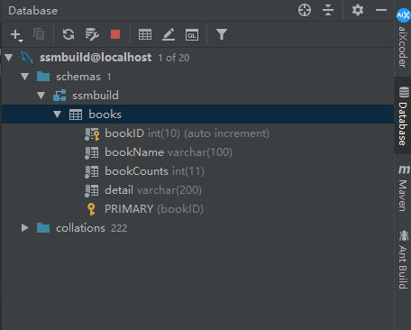

[TOC]


# 整合SSM

- 参考视频：[【狂神说Java】SpringMVC最新教程IDEA版通俗易懂_哔哩哔哩_bilibili](https://www.bilibili.com/video/BV1aE41167Tu)

- 项目完整参考代码：[lexiaoyuan/SpringStudy: My Spring study notes (github.com)](https://github.com/lexiaoyuan/SpringStudy)、[SpringStudy: 我的Spring学习笔记 (gitee.com)](https://gitee.com/lexiaoyuan/spring-study)

## 1. 基本环境搭建

### 1.1 数据库环境搭建

```sql
CREATE DATABASE ssmbuild;

USE ssmbuild;

CREATE TABLE books (
   bookID INT(10) PRIMARY KEY NOT NULL AUTO_INCREMENT COMMENT '书id',
   bookName VARCHAR(100) NOT NULL COMMENT '书名',
   bookCounts INT(11) NOT NULL COMMENT '数量',
   detail VARCHAR(200) NOT NULL COMMENT '描述'
) ENGINE=INNODB DEFAULT CHARSET=utf8mb4;

INSERT INTO books(bookID, bookName, bookCounts, detail) VALUES 
(1,'Java',1,'从入门到放弃'),
(2,'MySQL',10,'从删库到跑路'),
(3,'Linux',5,'从进门到进牢');
```

### 1.2 项目环境搭建

#### 1.2.1 基本操作

- 新建一个Maven工程`ssm_build`，删除src目录，作为父工程。
- `ssm_build`下面新建module：`ssm_build_basics`。
- IDEA连接上数据库`ssmbuild`



- 在`ssm_build_basics`的`pom.xml`中添加依赖。（这里先不在父工程中添加任何依赖，都添加到子项目中）

```xml
<dependencies>
    <!--junit-->
    <dependency>
        <groupId>junit</groupId>
        <artifactId>junit</artifactId>
        <version>4.12</version>
    </dependency>

    <!--MyBatis-->
    <dependency>
        <groupId>org.mybatis</groupId>
        <artifactId>mybatis</artifactId>
        <version>3.5.2</version>
    </dependency>
    <!--MySQL-->
    <dependency>
        <groupId>mysql</groupId>
        <artifactId>mysql-connector-java</artifactId>
        <version>5.1.47</version>
    </dependency>

    <!--Spring-->
    <dependency>
        <groupId>org.springframework</groupId>
        <artifactId>spring-webmvc</artifactId>
        <version>5.2.2.RELEASE</version>
    </dependency>
    <dependency>
        <groupId>org.springframework</groupId>
        <artifactId>spring-jdbc</artifactId>
        <version>5.1.9.RELEASE</version>
    </dependency>

    <!--MyBatis-Spring-->
    <dependency>
        <groupId>org.mybatis</groupId>
        <artifactId>mybatis-spring</artifactId>
        <version>2.0.3</version>
    </dependency>

    <!--Spring MVC-->
    <dependency>
        <groupId>javax.servlet</groupId>
        <artifactId>servlet-api</artifactId>
        <version>2.5</version>
    </dependency>
    <dependency>
        <groupId>javax.servlet.jsp</groupId>
        <artifactId>jsp-api</artifactId>
        <version>2.2</version>
    </dependency>
    <dependency>
        <groupId>javax.servlet</groupId>
        <artifactId>jstl</artifactId>
        <version>1.2</version>
    </dependency>

    <!--c3p0-->
    <dependency>
        <groupId>com.mchange</groupId>
        <artifactId>c3p0</artifactId>
        <version>0.9.5.5</version>
    </dependency>

</dependencies>
```

- 建好目录结构：`pojo`、`dao`、`service`、 `controller`。


#### 1.2.2 首先整合MyBatis

- 创建数据库连接配置：`database.properties`【有坑！！！】

```properties
# 注意：经测试，下面的名字必须要加上jdbc.  原因未知
jdbc.driver=com.mysql.jdbc.Driver
jdbc.url=jdbc:mysql://localhost:3306/ssmbuild?useUnicode=true&characterEncoding=UTF-8&serverTimezone=UTC&useSSL=true
jdbc.username=root
jdbc.password=123456
```

- 创建MyBatis核心配置文件：`mybatis-config.xml`

```xml
<?xml version="1.0" encoding="UTF-8" ?>
<!DOCTYPE configuration
        PUBLIC "-//mybatis.org//DTD Config 3.0//EN"
        "http://mybatis.org/dtd/mybatis-3-config.dtd">
<configuration>

    <typeAliases>
        <package name="com.ssm.pojo"/>
    </typeAliases>

</configuration>
```

- 创建实体类：`Books.java`

```java
package com.ssm.pojo;

public class Books {
    private int bookID;
    private String bookName;
    private int bookCounts;
    private String detail;

    public Books() {
    }

    public Books(int bookID, String bookName, int bookCounts, String detail) {
        this.bookID = bookID;
        this.bookName = bookName;
        this.bookCounts = bookCounts;
        this.detail = detail;
    }

    public int getBookID() {
        return bookID;
    }

    public void setBookID(int bookID) {
        this.bookID = bookID;
    }

    public String getBookName() {
        return bookName;
    }

    public void setBookName(String bookName) {
        this.bookName = bookName;
    }

    public int getBookCounts() {
        return bookCounts;
    }

    public void setBookCounts(int bookCounts) {
        this.bookCounts = bookCounts;
    }

    public String getDetail() {
        return detail;
    }

    public void setDetail(String detail) {
        this.detail = detail;
    }

    @Override
    public String toString() {
        return "Books{" +
                "bookID=" + bookID +
                ", bookName='" + bookName + '\'' +
                ", bookCounts=" + bookCounts +
                ", detail='" + detail + '\'' +
                '}';
    }
}
```

- 编写dao层的Mapper接口：`BooksMapper.java`

```java
package com.ssm.dao;

import com.ssm.pojo.Books;
import org.apache.ibatis.annotations.Param;

import java.util.List;

public interface BooksMapper {
    //增加一本书
    int insertBook(Books book);

    //删除一本书
    int deleteBookByBookID(@Param("bookID") int bookID);

    //修改一本书
    int updateBook(Books book);

    //通过bookID查询一本书
    Books selectByBookID(@Param("bookID") int bookID);

    //查询所有书
    List<Books> selectAllBooks();
}
```

- 编写接口对应的SQL映射文件：`BooksMapper.xml`

```xml
<?xml version="1.0" encoding="UTF-8" ?>
<!DOCTYPE mapper
        PUBLIC "-//mybatis.org//DTD Mapper 3.0//EN"
        "http://mybatis.org/dtd/mybatis-3-mapper.dtd">

<mapper namespace="com.ssm.dao.BooksMapper">
    <insert id="insertBook" parameterType="books">
        insert into books (bookName, bookCounts, detail)
        values (#{bookName}, #{bookCounts}, #{detail});
    </insert>

    <delete id="deleteBookByBookID" parameterType="_int">
        delete from books where bookID=#{bookID};
    </delete>

    <update id="updateBook" parameterType="books">
        update books
        set bookName=#{bookName}, bookCounts=#{bookCounts}, detail=#{detail}
        where bookID=#{bookID};
    </update>

    <select id="selectByBookID" parameterType="_int">
        select * from books where bookID=#{bookID};
    </select>

    <select id="selectAllBooks" resultType="books">
        select * from books;
    </select>
</mapper>
```

- 把`BooksMapper.xml`添加到`mybatis-config.xml`中

```xml
<mappers>
    <mapper resource="com/ssm/dao/BooksMapper.xml"/>
</mappers>
```

- 编写service层接口和实现类：`BooksService.java`、`BookServiceImpl.java`

  - 接口：`BooksService.java`

  ```java
  package com.ssm.service;
  
  import com.ssm.pojo.Books;
  
  import java.util.List;
  
  public interface BooksService {
      //增加一本书
      int insertBook(Books book);
  
      //删除一本书
      int deleteBookByBookID(int bookID);
  
      //修改一本书
      int updateBook(Books book);
  
      //通过bookID查询一本书
      Books selectByBookID(int bookID);
  
      //查询所有书
      List<Books> selectAllBooks();
  }
  ```

  - 实现类：`BookServiceImpl.java`

  ```java
  package com.ssm.service;
  
  import com.ssm.dao.BooksMapper;
  import com.ssm.pojo.Books;
  
  import java.util.List;
  
  public class BookServiceImpl implements BooksService {
      //service层调用dao层
      private BooksMapper booksMapper;
  
      public void setBooksMapper(BooksMapper booksMapper) {
          this.booksMapper = booksMapper;
      }
  
      public int insertBook(Books book) {
          return booksMapper.insertBook(book);
      }
  
      public int deleteBookByBookID(int bookID) {
          return booksMapper.deleteBookByBookID(bookID);
      }
  
      public int updateBook(Books book) {
          return booksMapper.updateBook(book);
      }
  
      public Books selectByBookID(int bookID) {
          return booksMapper.selectByBookID(bookID);
      }
  
      public List<Books> selectAllBooks() {
          return booksMapper.selectAllBooks();
      }
  }
  ```

**OK，到此，MaBatis层需求操作编写完毕！**

#### 1.2.3 再整合Spring

- 创建Spring的上下文配置文件：`applicationContext.xml`

```xml
<?xml version="1.0" encoding="UTF-8"?>
<beans xmlns="http://www.springframework.org/schema/beans"
       xmlns:xsi="http://www.w3.org/2001/XMLSchema-instance"
       xsi:schemaLocation="http://www.springframework.org/schema/beans
        https://www.springframework.org/schema/beans/spring-beans.xsd">

</beans>
```

- Spring整合MyBatis：`spring-dao.xml` 【有坑！！！】

```xml
<?xml version="1.0" encoding="UTF-8"?>
<beans xmlns="http://www.springframework.org/schema/beans"
       xmlns:xsi="http://www.w3.org/2001/XMLSchema-instance"
       xmlns:context="http://www.springframework.org/schema/context"
       xsi:schemaLocation="http://www.springframework.org/schema/beans
        https://www.springframework.org/schema/beans/spring-beans.xsd
        http://www.springframework.org/schema/context
        https://www.springframework.org/schema/context/spring-context.xsd">
    <!--Spring整合MyBatis-->
    <!--1. 关联数据库配置文件-->
    <context:property-placeholder location="classpath:database.properties"/>

    <!--2. 配置数据库连接池：c3p0-->
    <bean id="dataSource" class="com.mchange.v2.c3p0.ComboPooledDataSource">
        <!--【有坑！！！】注意：value中的值必须要加上jdbc. 和database.properties保持一致-->
        <property name="driverClass" value="${jdbc.driver}"/>
        <property name="jdbcUrl" value="${jdbc.url}"/>
        <property name="user" value="${jdbc.username}"/>
        <property name="password" value="${jdbc.password}"/>
        
        <!-- c3p0连接池的私有属性 -->
        <property name="maxPoolSize" value="30"/>
        <property name="minPoolSize" value="10"/>
        <!-- 关闭连接后不自动commit -->
        <property name="autoCommitOnClose" value="false"/>
        <!-- 获取连接超时时间 -->
        <property name="checkoutTimeout" value="10000"/>
        <!-- 当获取连接失败重试次数 -->
        <property name="acquireRetryAttempts" value="2"/>
    </bean>

    <!--3. 创建sqlSessionFactory-->
    <bean id="sqlSessionFactory" class="org.mybatis.spring.SqlSessionFactoryBean">
        <!--注入数据库连接池-->
        <property name="dataSource" ref="dataSource" />
        <!--绑定MyBatis核心配置文件-->
        <property name="configLocation" value="classpath:mybatis-config.xml"/>
    </bean>

    <!-- 4.配置扫描dao接口包，动态实现dao接口注入到spring容器中 -->
    <!--解释： https://www.cnblogs.com/jpfss/p/7799806.html-->
    <bean class="org.mybatis.spring.mapper.MapperScannerConfigurer">
        <!-- 注入sqlSessionFactory -->
        <property name="sqlSessionFactoryBeanName" value="sqlSessionFactory"/>
        <!-- 给出需要扫描dao接口包 -->
        <property name="basePackage" value="com.ssm.dao"/>
    </bean>
</beans>
```

- Spring整合service层：`spring-service.xml`

```xml
<?xml version="1.0" encoding="UTF-8"?>
<beans xmlns="http://www.springframework.org/schema/beans"
       xmlns:xsi="http://www.w3.org/2001/XMLSchema-instance"
       xmlns:context="http://www.springframework.org/schema/context"
       xsi:schemaLocation="http://www.springframework.org/schema/beans
        https://www.springframework.org/schema/beans/spring-beans.xsd
        http://www.springframework.org/schema/context
        https://www.springframework.org/schema/context/spring-context.xsd">
    <!--扫描service层的bean-->
    <context:component-scan base-package="com.ssm.service"/>

    <!--BookServiceImpl注入到IOC容器中-->
    <bean id="bookServiceImpl" class="com.ssm.service.BooksServiceImpl">
        <property name="booksMapper" ref="booksMapper"/>
    </bean>

    <!--业务层配置事务管理器-->
    <bean id="transactionManager" class="org.springframework.jdbc.datasource.DataSourceTransactionManager">
        <!--注入数据源-->
        <constructor-arg ref="dataSource" />
    </bean>
</beans>
```

- 在`applicationContext.xml`中导入`spring-service.xml`和`spring-dao.xml`

```xml
<import resource="spring-dao.xml"/>
<import resource="spring-service.xml"/>
```

**OK!，到此，Spring与MyBatis的整合完成！Spring就是一个大杂烩！**

#### 1.2.4 再整合Spring MVC

- 首先添加Web支持
- 配置`web.xml`

```xml
<?xml version="1.0" encoding="UTF-8"?>
<web-app xmlns="http://xmlns.jcp.org/xml/ns/javaee"
         xmlns:xsi="http://www.w3.org/2001/XMLSchema-instance"
         xsi:schemaLocation="http://xmlns.jcp.org/xml/ns/javaee http://xmlns.jcp.org/xml/ns/javaee/web-app_4_0.xsd"
         version="4.0">
    <!--DispatcherServlet-->
    <servlet>
        <servlet-name>springmvc</servlet-name>
        <servlet-class>org.springframework.web.servlet.DispatcherServlet</servlet-class>
        <init-param>
            <param-name>contextConfigLocation</param-name>
            <!--注意：整合后，这里要配置总的-->
            <param-value>classpath:applicationContext.xml</param-value>
        </init-param>
        <load-on-startup>1</load-on-startup>
    </servlet>
    <servlet-mapping>
        <servlet-name>springmvc</servlet-name>
        <url-pattern>/</url-pattern>
    </servlet-mapping>

    <!--EncodingFilter-->
    <filter>
        <filter-name>encodingFilter</filter-name>
        <filter-class>org.springframework.web.filter.CharacterEncodingFilter</filter-class>
        <init-param>
            <param-name>encoding</param-name>
            <param-value>utf-8</param-value>
        </init-param>
    </filter>
    <filter-mapping>
        <filter-name>encodingFilter</filter-name>
        <url-pattern>/*</url-pattern>
    </filter-mapping>

    <!--Session过期时间:15分钟-->
    <session-config>
        <session-timeout>15</session-timeout>
    </session-config>
</web-app>
```

- 整合Spring MVC，创建`spring-mvc.xml`

```xml
<?xml version="1.0" encoding="UTF-8"?>
<beans xmlns="http://www.springframework.org/schema/beans"
       xmlns:xsi="http://www.w3.org/2001/XMLSchema-instance"
       xmlns:context="http://www.springframework.org/schema/context"
       xmlns:mvc="http://www.springframework.org/schema/mvc"
       xsi:schemaLocation="http://www.springframework.org/schema/beans
        http://www.springframework.org/schema/beans/spring-beans.xsd
        http://www.springframework.org/schema/context
        https://www.springframework.org/schema/context/spring-context.xsd
        http://www.springframework.org/schema/mvc
        https://www.springframework.org/schema/mvc/spring-mvc.xsd">

    <!--整合SpringMVC-->
    <!--包扫描-->
    <context:component-scan base-package="com.ssm.controller"/>
    <!--注解驱动-->
    <mvc:annotation-driven/>
    <!--静态资源过滤-->
    <mvc:default-servlet-handler/>

    <!--视图解析器-->
    <bean id="internalResourceViewResolver" class="org.springframework.web.servlet.view.InternalResourceViewResolver">
        <property name="prefix" value="/WEB-INF/jsp/"/>
        <property name="suffix" value=".jsp"/>
    </bean>
</beans>
```

- WEB-INF目录下新建一个jsp目录
- 将`spring-mvc.xml`导入到`applicationContext.xml`

```xml
<import resource="spring-mvc.xml"/>
```

**OK！到此，配置文件已经基本完成！可以开始Controller和jsp的编写！**

#### 1.2.4 开始写Controller

- 创建`BooksController.java`

```java
@Controller
@RequestMapping("/books")
public class BooksController {
    // controller层调service层

    private final BooksService booksService;

    public BooksController(@Qualifier("bookServiceImpl") BooksService booksService) {
        this.booksService = booksService;
    }

    @GetMapping("/allBooks")
    public String allBooks(Model model){
        List<Books> booksList = booksService.selectAllBooks();
        model.addAttribute("booksList", booksList);
        return "allBooks";  //allBooks.jsp
    }
    
}
```

- 创建`allBooks.jsp`

```jsp
<%@ page contentType="text/html;charset=UTF-8" language="java" %>
<html>
<head>
    <title>全部书籍</title>
</head>
<body>
    ${booksList}
</body>
</html>
```

- 修改`index.jsp`，通过`index.jsp`来点击链接跳转`allBooks.jsp`

```jsp
<%@ page contentType="text/html;charset=UTF-8" language="java" %>
<html>
  <head>
    <title>首页</title>
  </head>
  <body>
    <h3>
      <a href="${pageContext.request.contextPath}/books/allBooks">全部书籍</a>
    </h3>
  </body>
</html>
```

- 打包部署到Tomcat。**不要忘记，在Project Structure中添加lib依赖**
- 浏览器测试：运行Tomcat后

> 在浏览器输入：http://localhost:8080/ssm_build_basics/
>
> 显示：
>
> 点击链接，跳转到：http://localhost:8080/ssm_build_basics/books/allBooks
>
> 显示：[Books{bookID=1, bookName='Java', bookCounts=1, detail='从入门到放弃'}, Books{bookID=2, bookName='MySQL', bookCounts=10, detail='从删库到跑路'}, Books{bookID=3, bookName='Linux', bookCounts=5, detail='从进门到进牢'}]

- Junit测试：
  - 在`test/java`目录下新建包`com.ssm.controller`（尽量保持包目录结构一样），和 `BooksControllerTest.java`

  ```java
  public class BooksControllerTest {
      @Test
      public void allBooksTest() {
          ApplicationContext context = new ClassPathXmlApplicationContext("applicationContext.xml");
          BooksService bookService = context.getBean("bookServiceImpl", BooksServiceImpl.class);
          for (Books book : bookService.selectAllBooks()) {
              System.out.println(book);
          }
      }
  }
  ```

  - 运行结果：

    > Books{bookID=1, bookName='Java', bookCounts=1, detail='从入门到放弃'}
    > Books{bookID=2, bookName='MySQL', bookCounts=10, detail='从删库到跑路'}
    > Books{bookID=3, bookName='Linux', bookCounts=5, detail='从进门到进牢'}

- 修改`allBooks.jsp`，使显示得效果好一点

```jsp
<%@ page contentType="text/html;charset=UTF-8" language="java" %>
<%@ taglib prefix="c" uri="http://java.sun.com/jsp/jstl/core" %>
<html>
<head>
    <title>全部书籍</title>
</head>
<body>
    <div>
        <table>
            <thead>
            <tr>
                <th>书籍编号</th>
                <th>书籍名字</th>
                <th>书籍数量</th>
                <th>书籍详情</th>
                <th>操作</th>
            </tr>
            </thead>

            <tbody>
            <c:forEach var="book" items="${requestScope.get('booksList')}">
                <tr>
                    <td>${book.getBookID()}</td>
                    <td>${book.getBookName()}</td>
                    <td>${book.getBookCounts()}</td>
                    <td>${book.getDetail()}</td>
                    <td>
                        <a href="#">更改</a> |
                        <a href="#">删除</a>
                    </td>
                </tr>
            </c:forEach>
            </tbody>
        </table>
    </div>
</body>
</html>
```

- 新的显示效果：


#### 1.2.5 附目录结构


### 1.3  增删改查CRUD

> 增加(Create)、读取(Retrieve)、更新(Update)、删除(Delete)

**查询所有书籍上面已经写过了，这里不再重复。**

#### 1.3.1 增加书籍

- 在Controller层`BooksController.java`中写方法接受请求

```java
//跳转到增加书籍页面
@GetMapping("/toInsertBook")
public String toInsertBook(){
    return "insertBook";  //insertBook.jsp
}

@PostMapping("/insertBook")
public String insertBook(Books book){
    System.out.println("insertBook===>"+book);
    booksService.insertBook(book);
    return "redirect:/books/allBook"; //重定向到/books/allBook请求
}
```

- 编写`insertBook.jsp`

```jsp
<%@ page contentType="text/html;charset=UTF-8" language="java" %>
<html>
<head>
    <title>添加书籍</title>
</head>
<body>
    <h3>添加书籍</h3>
    <form action="${pageContext.request.contextPath}/books/insertBook" method="post">
        <p>书籍名称：<input type="text" name="bookName" required></p>
        <p>书籍数量：<input type="number" name="bookCounts" required></p>
        <p>书籍描述：<input type="text" name="detail" required></p>
        <p><input type="submit" value="确定添加"></p>
    </form>
</body>
</html>
```

- 前端`allBook.jsp`中增加添加书籍的链接：(添加到table标签上面即可)

```html
<div>
    <a href="${pageContext.request.contextPath}/books/toInsertBook">增加书籍</a>
</div>
```

- 测试：略。（见后面总测试）

#### 1.3.2 修改书籍

- 在Controller层`BooksController.java`中写方法接受请求

> 【注意】：由于修改书籍的SQL语句中需要通过bookID来修改，所以在前端单击修改链接的时候需要把当前要修改的书的ID传到Controller！

```java
//跳转到修改书籍页面
@GetMapping("/toUpdateBook/{bookID}")
public String toUpdateBook(@PathVariable("bookID") int bookID, Model model){
    model.addAttribute("updateBook", booksService.selectBookByBookID(bookID));
    return "updateBook";  //updateBook.jsp
}

@PostMapping("/updateBook/{bookID}")
public String updateBook(@PathVariable("bookID") int bookID, Books book){
    book.setBookID(bookID);
    System.out.println("updateBook===>"+book);
    booksService.updateBook(book);
    return "redirect:/books/allBook"; //重定向到/books/allBook请求
}
```

- 编写`updateBook.jsp`

```jsp
<%@ page contentType="text/html;charset=UTF-8" language="java" %>
<html>
<head>
    <title>修改书籍</title>
</head>
<body>
    <h3>修改书籍</h3>
    <form action="${pageContext.request.contextPath}/books/updateBook/${updateBook.bookID}" method="post">
        <p>书籍名称：<input type="text" name="bookName" value="${updateBook.bookName}" required></p>
        <p>书籍数量：<input type="number" name="bookCounts" value="${updateBook.bookCounts}" required></p>
        <p>书籍描述：<input type="text" name="detail" value="${updateBook.detail}" required></p>
        <p><input type="submit" value="确定修改"></p>
    </form>
</body>
</html>
```

- 前端`allBook.jsp`中增加修改书籍的链接：(更改href的值即可)

```jsp
<a href="${pageContext.request.contextPath}/books/toUpdateBook/${book.bookID}">修改</a>
```

- 测试：略。（见后面总测试）

#### 1.3.3 删除书籍

- 在Controller层`BooksController.java`中写方法接受请求

```java
@GetMapping("/deleteBook/{bookID}")
public String deleteBook(@PathVariable("bookID") int bookID){
    booksService.deleteBookByBookID(bookID);
    return "redirect:/books/allBook"; //重定向到/books/allBook请求
}
```

- 前端`allBook.jsp`中增加删除书籍的链接：(更改href的值即可)

```jsp
<a href="${pageContext.request.contextPath}/books/deleteBook/${book.bookID}">删除</a>
```

- 测试：略。（见后面总测试）

#### 1.3.4 模糊搜索书籍【扩展功能】

- 首先在接口`BooksMapper.java`中新增一个方法：

```java
//通过bookName查询书籍
List<Books> selectBookByBookName(@Param("bookName") String bookName);
```

- 在`BooksMapper.xml`写对应的SQL语句

```xml
<select id="selectBookByBookName" resultType="books" parameterType="string">
    select * from books where bookName like #{bookName};
</select>
```

- 在service层新增同样的接口方法及实现：

```java
//interface BooksService
//通过bookName查询书籍
List<Books> selectBookByBookName(String bookName);
```

```java
//BooksServiceImpl implements BooksService
public List<Books> selectBookByBookName(String bookName) {
    return booksMapper.selectBookByBookName(bookName);
}
```

- 在Controller层`BooksController.java`中写方法接受请求

```java
@PostMapping("/searchBook")
public String searchBook(String bookName, Model model){
    System.out.println("searchBook==>bookName:"+bookName);
    List<Books> booksList = booksService.selectBookByBookName("%"+bookName+"%"); //like语句不能再xml中拼接，要在这里拼接
    for (Books books : booksList) {
        System.out.println(books);
    }
    model.addAttribute("booksList", booksList);
    return "allBook";
}
```

- 前端`allBook.jsp`中增加搜索输入框和搜索按钮：(写在增加链接的下面即可)

```jsp
<div>
    <form action="${pageContext.request.contextPath}/books/searchBook/" method="post">
        <input type="text" name="bookName" required>
        <input type="submit" value="搜索">
    </form>
</div>
```

- 在增加链接旁边新增一个查看全部书籍的链接，方便搜索完之后好返回全部书籍页面：(写在增加链接的下面即可)

```jsp
&nbsp;&nbsp;&nbsp;&nbsp;
<a href="${pageContext.request.contextPath}/books/allBook">全部书籍</a>
```

- 测试：略。（见后面总测试）

#### 1.3.5 功能测试

- 访问：http://localhost:8080/ssm_build_CRUD/  。点击链接：

- 显示全部书籍：

- 点击增加书籍链接：
- 显示增加书籍页面：输入信息，点击确定添加按钮：

- 显示全部书籍：看到新增加书籍成功

- 随便选择一本书，点击修改链接：
- 显示修改书籍页面：
- 输入修改后的信息：，点击确定修改按钮：
- 显示全部书籍，可以看到，修改成功

- 随便选择一本书，单击删除链接：，这里删除 "计算机基础"

- 显示全部书籍，可以看到，删除成功：

- 在搜索框内输入书籍名字，点击搜索按钮来搜索书籍

- 显示书籍名称中带有Java的书籍：

- 点击全部书籍链接：
- 显示全部书籍页面：

#### 1.3.6 存在的问题

到目前为止，主要存在以下问题暂未解决：

- 存在SQL注入
- 页面太丑，交互不好
- 等等。。。

